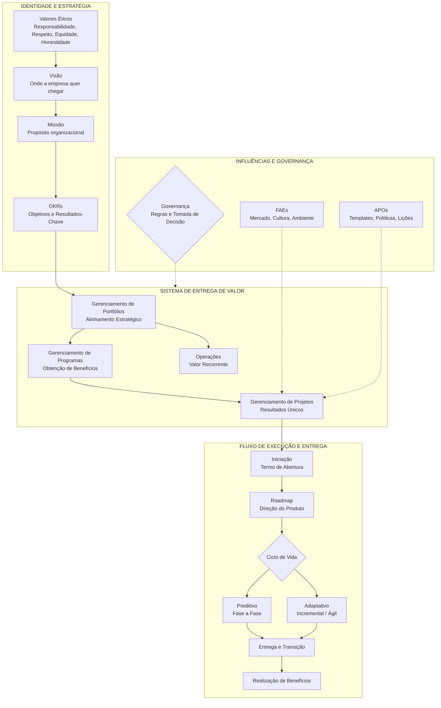

```mermaid
flowchart TD

%% IDENTIDADE E ESTRATÉGIA
subgraph Estrategia [IDENTIDADE E ESTRATÉGIA]
    VAL["Valores Éticos<br>Responsabilidade, Respeito, Equidade, Honestidade"]
    VIS["Visão<br>Onde a empresa quer chegar"]
    MIS["Missão<br>Propósito organizacional"]
    OKR["OKRs<br>Objetivos e Resultados-Chave"]

    VAL --> VIS --> MIS --> OKR
end

%% INFLUÊNCIAS E GOVERNANÇA
subgraph Influencias [INFLUÊNCIAS E GOVERNANÇA]
    direction LR
    FAE["FAEs<br>Mercado, Cultura, Ambiente"]
    APO["APOs<br>Templates, Políticas, Lições"]
    GOV{"Governança<br>Regras e Tomada de Decisão"}
end

%% SISTEMA DE ENTREGA DE VALOR
subgraph GOP [SISTEMA DE ENTREGA DE VALOR]
    PORT["Gerenciamento de Portfólios<br>Alinhamento Estratégico"]
    PROG["Gerenciamento de Programas<br>Obtenção de Benefícios"]
    PROJ["Gerenciamento de Projetos<br>Resultados Únicos"]
    OPER["Operações<br>Valor Recorrente"]

    PORT --> PROG
    PROG --> PROJ
    PORT --> OPER
end

%% FLUXO DE EXECUÇÃO
subgraph Fluxo [FLUXO DE EXECUÇÃO E ENTREGA]
    START["Iniciação<br>Termo de Abertura"]
    ROAD["Roadmap<br>Direção do Produto"]
    LIFE{"Ciclo de Vida"}
    PRED["Preditivo<br>Fase a Fase"]
    ADAP["Adaptativo<br>Incremental / Ágil"]
    ENTREGA["Entrega e Transição"]
    BENE["Realização de Benefícios"]

    START --> ROAD --> LIFE
    LIFE --> PRED
    LIFE --> ADAP
    PRED --> ENTREGA
    ADAP --> ENTREGA
    ENTREGA --> BENE
end

%% CONEXÕES ENTRE CAMADAS
OKR --> PORT
PROJ --> START
FAE -.-> PROJ
APO -.-> PROJ
GOV -.-> GOP
```
