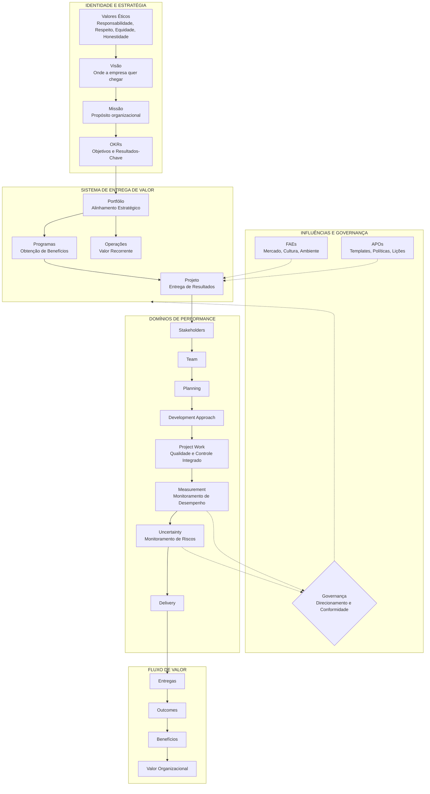

```mermaid
flowchart TD

%% IDENTIDADE E ESTRATÉGIA
subgraph Estrategia [IDENTIDADE E ESTRATÉGIA]
    VAL["Valores Éticos<br>Responsabilidade, Respeito, Equidade, Honestidade"]
    VIS["Visão<br>Onde a empresa quer chegar"]
    MIS["Missão<br>Propósito organizacional"]
    OKR["OKRs<br>Objetivos e Resultados-Chave"]

    VAL --> VIS --> MIS --> OKR
end

%% INFLUÊNCIAS E GOVERNANÇA
subgraph Influencias [INFLUÊNCIAS E GOVERNANÇA]
    direction LR
    FAE["FAEs<br>Mercado, Cultura, Ambiente"]
    APO["APOs<br>Templates, Políticas, Lições"]
    GOV{"Governança<br>Direcionamento e Conformidade"}
end

%% SISTEMA DE ENTREGA DE VALOR
subgraph GOP [SISTEMA DE ENTREGA DE VALOR]
    PORT["Portfólio<br>Alinhamento Estratégico"]
    PROG["Programas<br>Obtenção de Benefícios"]
    PROJ["Projeto<br>Entrega de Resultados"]
    OPER["Operações<br>Valor Recorrente"]

    PORT --> PROG
    PROG --> PROJ
    PORT --> OPER
end

%% DOMÍNIOS DE PERFORMANCE DO PROJETO (PMBOK 7)
subgraph Dominios [DOMÍNIOS DE PERFORMANCE]
    STK["Stakeholders"]
    TEAM["Team"]
    PLAN["Planning"]
    DEV["Development Approach"]
    WORK["Project Work<br>Qualidade e Controle Integrado"]
    MEAS["Measurement<br>Monitoramento de Desempenho"]
    UNC["Uncertainty<br>Monitoramento de Riscos"]
    DEL["Delivery"]

    STK --> TEAM --> PLAN --> DEV --> WORK --> MEAS --> UNC --> DEL
end

%% FLUXO DE VALOR
subgraph Valor [FLUXO DE VALOR]
    ENT["Entregas"]
    OUT["Outcomes"]
    BEN["Benefícios"]
    VALOR["Valor Organizacional"]

    ENT --> OUT --> BEN --> VALOR
end

%% CONEXÕES
OKR --> PORT
PROJ --> STK
FAE -.-> PROJ
APO -.-> PROJ
GOV -.-> GOP
DEL --> ENT
MEAS -.-> GOV
UNC -.-> GOV
```
