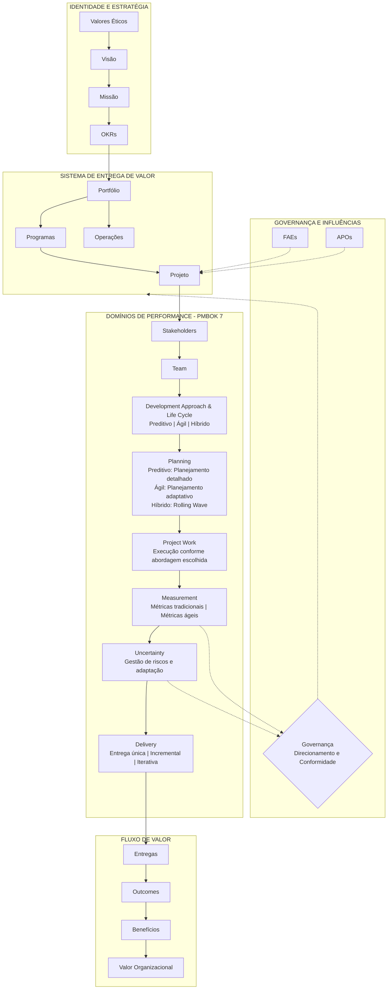

```mermaid
flowchart TD

%% IDENTIDADE E ESTRATÉGIA
subgraph Estrategia [IDENTIDADE E ESTRATÉGIA]
    VAL["Valores Éticos"]
    VIS["Visão"]
    MIS["Missão"]
    OKR["OKRs"]

    VAL --> VIS --> MIS --> OKR
end

%% GOVERNANÇA
subgraph Influencias [GOVERNANÇA E INFLUÊNCIAS]
    direction LR
    FAE["FAEs"]
    APO["APOs"]
    GOV{"Governança<br>Direcionamento e Conformidade"}
end

%% SISTEMA DE ENTREGA DE VALOR
subgraph GOP [SISTEMA DE ENTREGA DE VALOR]
    PORT["Portfólio"]
    PROG["Programas"]
    PROJ["Projeto"]
    OPER["Operações"]

    PORT --> PROG
    PROG --> PROJ
    PORT --> OPER
end

%% DOMÍNIOS DE PERFORMANCE
subgraph Dominios [DOMÍNIOS DE PERFORMANCE - PMBOK 7]

    STK["Stakeholders"]
    TEAM["Team"]

    DEV["Development Approach & Life Cycle<br>Preditivo | Ágil | Híbrido"]

    PLAN["Planning<br>Preditivo: Planejamento detalhado<br>Ágil: Planejamento adaptativo<br>Híbrido: Rolling Wave"]

    WORK["Project Work<br>Execução conforme abordagem escolhida"]

    MEAS["Measurement<br>Métricas tradicionais | Métricas ágeis"]

    UNC["Uncertainty<br>Gestão de riscos e adaptação"]

    DEL["Delivery<br>Entrega única | Incremental | Iterativa"]

    STK --> TEAM --> DEV --> PLAN --> WORK --> MEAS --> UNC --> DEL
end

%% FLUXO DE VALOR
subgraph Valor [FLUXO DE VALOR]
    ENT["Entregas"]
    OUT["Outcomes"]
    BEN["Benefícios"]
    VALOR["Valor Organizacional"]

    ENT --> OUT --> BEN --> VALOR
end

%% CONEXÕES
OKR --> PORT
PROJ --> STK
FAE -.-> PROJ
APO -.-> PROJ
GOV -.-> GOP
DEL --> ENT
MEAS -.-> GOV
UNC -.-> GOV
```
