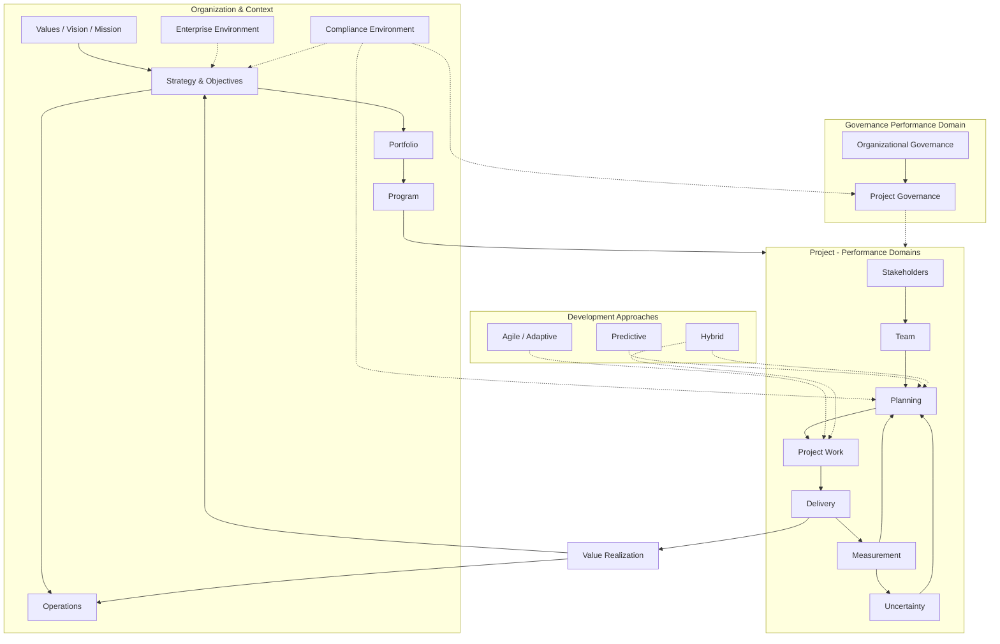

```mermaid
flowchart TB

subgraph ORG["Organization & Context"]
  VVM["Values / Vision / Mission"]
  STRAT["Strategy & Objectives"]
  EEF["Enterprise Environment"]
  COMP["Compliance Environment"]

  VVM --> STRAT
  EEF -.-> STRAT
  COMP -.-> STRAT

  PORT["Portfolio"]
  PROG["Program"]
  OPS["Operations"]

  STRAT --> PORT
  PORT --> PROG
  STRAT --> OPS
end

subgraph GOV["Governance Performance Domain"]
  OG["Organizational Governance"]
  PG["Project Governance"]
  OG --> PG
end

subgraph PROJ["Project - Performance Domains"]
  STK["Stakeholders"]
  TEAM["Team"]
  PLAN["Planning"]
  WORK["Project Work"]
  DEL["Delivery"]
  MEAS["Measurement"]
  UNC["Uncertainty"]

  STK --> TEAM --> PLAN --> WORK --> DEL --> MEAS --> UNC
  MEAS --> PLAN
  UNC --> PLAN
end

subgraph APPR["Development Approaches"]
  PRED["Predictive"]
  AGILE["Agile / Adaptive"]
  HYB["Hybrid"]
end

PROG --> PROJ
DEL --> VALUE["Value Realization"]
VALUE --> OPS
VALUE --> STRAT

PG -.-> PROJ
COMP -.-> PG
COMP -.-> PLAN

PRED -.-> PLAN
AGILE -.-> WORK
HYB -.-> PLAN
HYB -.-> WORK
```
